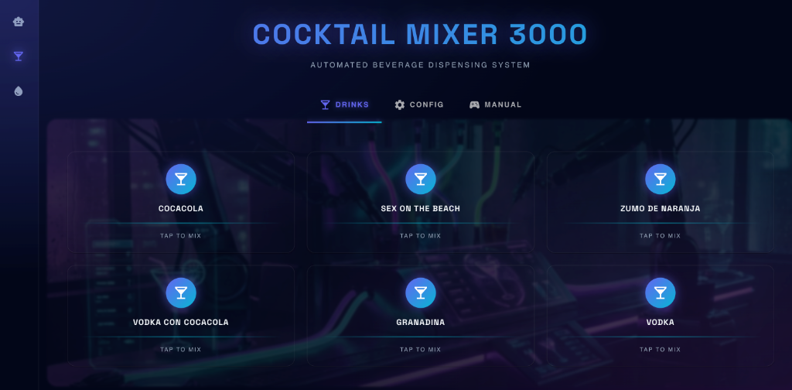

# RobotCore - Sistema de Riego Inteligente & Cocktelería Automática (ESP8266 + React)

## 🌟 Descripción del Proyecto

Este ecosistema de software y hardware permite el control avanzado del microcontrolador **ESP8266** (NodeMCU, Wemos D1 Mini, etc.) a través de una interfaz web moderna construida con **React**. 

Orientado originalmente al riego automatizado, el proyecto ha evolucionado hacia la creación de una **máquina de cocktelería ultra compacta**, aprovechando la conectividad Wi-Fi nativa del ESP8266 para gestionar múltiples bombas de agua con precisión PWM (Pulse Width Modulation).

> **🌐 [Visita RobotCore](https://wifi-irrigation-system.vercel.app/)**

---

## 🎨 Interfaz Cyberpunk Premium

El dashboard cuenta con un diseño **cyberpunk de alta calidad** con efectos de glassmorphism, neon glows y animaciones fluidas.

### 🤖 RobotCore Dashboard


Control completo del robot con:
- **Neural Telemetry**: Visualización de giroscopio MPU en tiempo real
- **RGB Module**: Selector de color con preview y efectos de glow
- **Kinetic Control**: D-pad para control direccional con indicadores de estado
- **Actuators**: Panel de control de pines y outputs

### 🌿 Sistema de Riego


Automatización de riego inteligente:
- **Status Actual**: Temperatura y hora ESP en tiempo real
- **Programación**: Gestión de tareas por días y horarios
- **Configuración**: Selector de días y hora para nuevas tareas
- **Control Manual**: Ajustes directos de bombas

### �🍹 Cocktail Mixer 3000



Sistema automatizado de mezcla de bebidas:
- **Grid de bebidas**: Selección rápida con efectos visuales premium
- **Configuración de bombas**: Control PWM y calibración de tiempo
- **Control manual**: D-pad para activación individual de bombas

---

## 🛠️ Tecnologías Utilizadas

### Frontend
- **React (v19+)**: Interfaz dinámica y reactiva.
- **Vite**: Sistema de construcción ultra rápido (Sustituyendo a CRA).
- **TypeScript**: Robustez y tipado estático con alias `@/`.
- **Material UI (MUI)**: Sistema de diseño moderno.
- **WebSocket**: Comunicación en tiempo real de baja latencia.
- **Clean Code Architecture**: Separación en Models, Hooks y Components.

### Backend / Firmware
- **ESP8266 Core for Arduino**: Firmware optimizado para el chip ESP8266.
- **AsyncWebServer**: Servidor HTTP asíncrono para ESP8266.
- **Node.js (Mock Server)**: Para desarrollo local sin necesidad del chip físico.

---

## 🏗️ Estructura del Proyecto

El repositorio está organizado de forma modular para facilitar el mantenimiento y escalabilidad:

- `/client`: Aplicación frontend en React + Vite.
  - `/src/models`: Definiciones de tipos TypeScript
  - `/src/pages`: Páginas principales (Car, Water, Drinks)
  - `/src/components`: Componentes reutilizables
  - `/src/hooks`: Custom hooks para lógica de negocio
- `/server`:
    - `/firmware`: Código fuente en C++ para el microcontrolador (Arduino IDE / PlatformIO).
    - `/mock`: Servidor de simulación en Node.js que imita el comportamiento del hardware para pruebas locales.

---

## 🚀 Instalación y Ejecución

### Opción Rápida (Scripts de un solo clic)
He creado scripts para facilitar el inicio del proyecto (instala dependencias y lanza los servidores):

- **Mac/Linux:**
  ```bash
  ./run-mac.sh
  ```
- **Windows:**
  Doble clic en `run-windows.bat` o:
  ```batch
  run-windows.bat
  ```

---

### Instalación Manual
Si prefieres hacerlo paso a paso:

### 3. Firmware (Hardware Real)
Para desplegar en el ESP8266:
1. Abre el archivo en `/server/firmware` con Arduino IDE.
2. Configura tus credenciales Wi-Fi en `configNetwork.h`.
3. Carga el sketch a tu dispositivo vía USB.

---

## 📋 Características Implementadas

### Dashboard RobotCore
- [x] Control de robot con joystick D-pad
- [x] Visualización de giroscopio MPU
- [x] Control RGB con selector de color
- [x] Indicadores de estado en tiempo real

### Sistema de Riego
- [x] Programación de tareas por días y horarios
- [x] Visualización de temperatura y hora ESP
- [x] Control manual de bombas
- [x] Grid responsive con glassmorphism

### Cocktail Mixer
- [x] Control de 4 bombas vía PWM
- [x] Interfaz de calibración de caudales
- [x] Selección de bebidas predefinidas
- [x] Control manual con D-pad
- [x] Comunicación WebSocket estable

---

## 🎯 Próximas Mejoras
- [ ] Gestión de recetas personalizadas
- [ ] Calendario de riego automático avanzado
- [ ] Integración con sensores de humedad
- [ ] Sistema de notificaciones push

---

## 🤝 Contribuciones e Ideas
El proyecto está en constante evolución. Se aceptan sugerencias, reportes de bugs y nuevas ideas para ampliar las capacidades del sistema.

*¡Que tengas un excelente día de desarrollo!* :)
