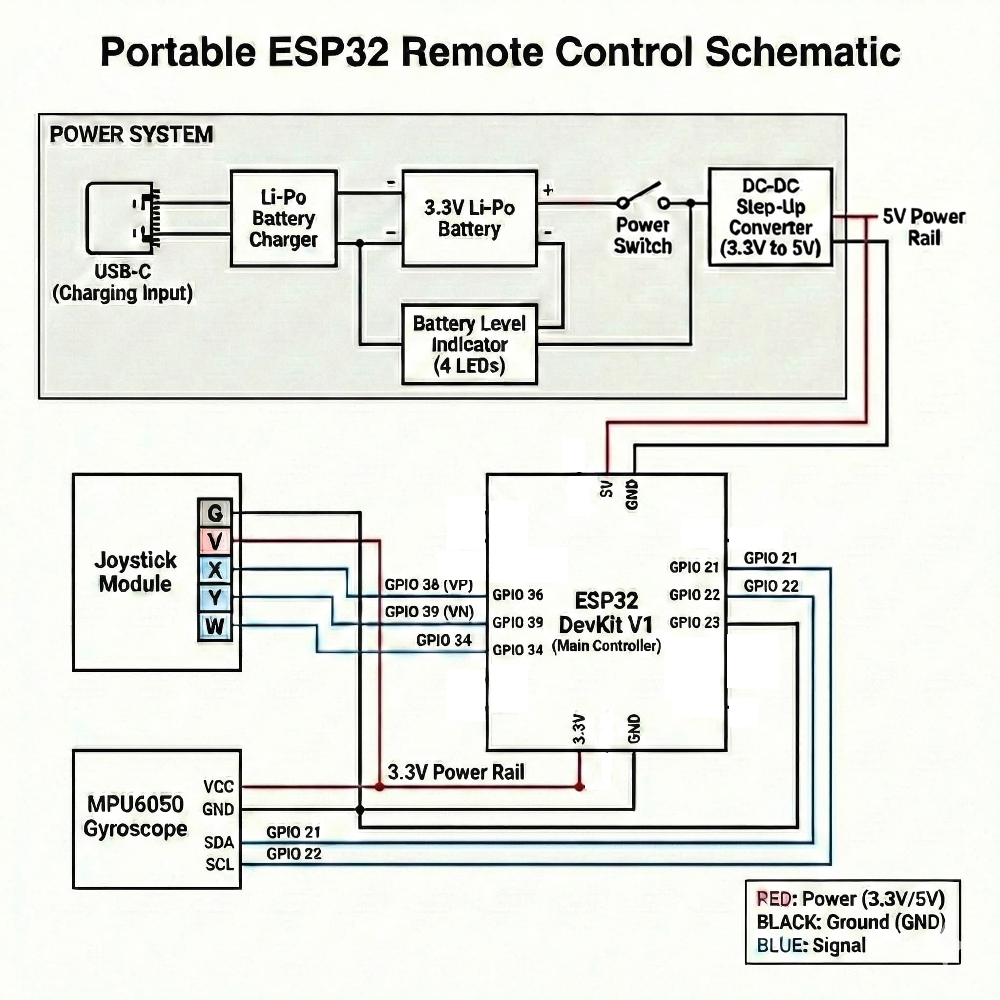

# Mando a Distancia Físico (ESP32)

## Descripción General
Un mando a distancia portátil dedicado construido con un **ESP32** 38 PINES. Cuenta con un joystick físico y un giroscopio MPU6050 para un modo dual de control del robot. Se comunica vía **ESP-NOW** para una latencia casi nula.

## Configuración de Hardware
| Componente | Pin | Función |
| :--- | :--- | :--- |
| **Joystick X** | 36 (VP) | Movimiento lateral |
| **Joystick Y** | 39 (VN) | Movimiento vertical |
| **Joystick SW**| 34 | Entrada de botón |
| **MPU6050 SDA**| 21 | Datos I2C |
| **MPU6050 SCL**| 22 | Reloj I2C |
| **Batería** | 3.3V | Li-Po / Li-Ion |
| **Carga** | USB-C | Entrada 5V |
| **Boost DC-DC** | 3.3V -> 5V | Elevador de tensión para alimentar a 5v el esp32|

## Sistema de Alimentación
El mando es totalmente portátil gracias a su sistema de gestión de energía:
1.  **Batería 3.3V**: Fuente de alimentación principal.
2.  **Interruptor**: Corte físico de energía.
3.  **DC-DC Boost**: Eleva los 3.3V de la batería a 5V estables para alimentar el pin 5v del ESP32.
4.  **Indicador de Batería**: Módulo de 4 LEDs para visualizar el nivel de carga restante.
5.  **Carga USB-C**: Puerto moderno para recargar la batería.

## Características Principales
- **Control Dual**: Joystick y Giroscopio (MPU6050).
- **Control Offline**: Comunicación de baja latencia vía **ESP-NOW** sin necesidad de WiFi.
- **Telemetría Directa**: Servidor de WebSockets integrado para enviar datos a React en tiempo real (`/ws/remote`).
- **Arranque Híbrido**: El hardware y el control ESP-NOW arrancan instantáneamente; la conexión WiFi se gestiona en segundo plano sin bloquear el uso.

## Estructura del Proyecto
- `JoystickManager.hpp`: Lee y filtra la entrada del joystick.
- `GiroscopeManager.hpp`: Procesa los datos del MPU6050 y calcula orientaciones.
- `CommunicationManager.hpp`: Gestiona el protocolo ESP-NOW con el robot.
- `WebSocketManager.hpp`: Servidor para telemetría directa hacia el Dashboard web.
- `remote-control.ino`: Bucle principal con gestión de estados y priorización de hardware.
