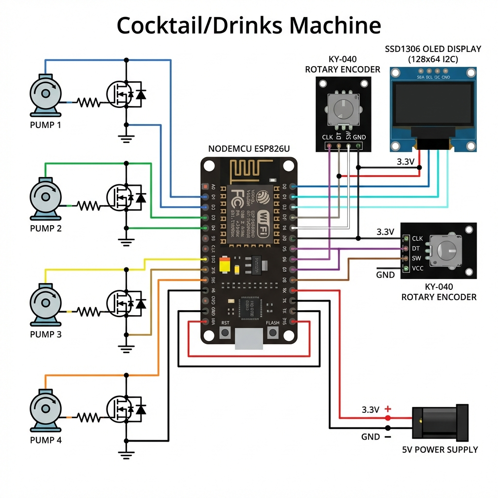

# Módulo Máquina de Bebidas

## Descripción General
El módulo Máquina de Bebidas gestiona la selección y el dispensado de bebidas y cócteles. Proporciona una interfaz de usuario física utilizando una pantalla OLED y un encoder rotativo, permitiendo el funcionamiento autónomo sin necesidad de un smartphone.

## Detalles de Implementación
- **Ubicación**: `server/firmware/apps/drinks machine/`
- **Controlador Principal**: `controller.hpp` (Clase: `EncoderManager`)
- **IU/Pantalla**: `utils/display.hpp` (Clase: `DisplayManager`)
- **Activos (Assets)**: `utils/display.hpp` (Espacio de nombres: `DisplayAssets`)

## Configuración de Hardware (ESP8266)
| Componente | Pin | Función |
| :--- | :--- | :--- |
| **Encoder CLK** | GPIO 13 (D7) | Detección de Pasos |
| **Encoder DT**  | GPIO 12 (D6) | Detección de Dirección |
| **Encoder SW**  | GPIO 14 (D5) | Clic del Botón |
| **OLED (SSD1306)**| D2/D1 | Comunicación I2C |

## Características

### 1. Interfaz Autónoma
El sistema utiliza la **pantalla OLED** para mostrar un menú de líquidos (Agua, CocaCola, Vodka, Naranja) y cócteles predefinidos (Sex on The Beach, etc.).

### 2. Máquina de Estados de Navegación
El botón del encoder permite navegar a través de diferentes pantallas:
- **Index Server**: Menú principal de desplazamiento.
- **Pantalla de Servicio**: Muestra el estado mientras las bombas están activas.
- **Pantalla Final**: Confirmación de bebida servida.

### 3. Gestión Dinámica de Bebidas
Las bebidas se almacenan utilizando `std::vector` y se definen como `struct Drink` y `struct Cocktail`, lo que facilita añadir o modificar recetas sin reestructurar el código.

### 4. Visuales Optimizados
Los iconos de cócteles y los activos de la IU se almacenan en `PROGMEM` como mapas de bits (bitmaps) para maximizar la RAM disponible para el servidor web y las tareas de red.

## Endpoints de la API
Los endpoints para el módulo de bebidas se encuentran en `services/API.hpp` y permiten la activación remota del proceso de servicio.

## Integración con Mando Físico
Este módulo soporta el control remoto a través del joystick físico:
- **Joystick Arriba/Abajo**: Navegación por el menú de bebidas (simula el encoder).
- **Botón del Joystick**: Selecciona la bebida o cóctel actual (simula el clic del encoder).
- **Control Offline**: El control físico es totalmente autónomo y funciona vía ESP-NOW, sin necesidad de WiFi ni conexión web.
- **Telemetría Opcional**: Los movimientos del mando se reflejan en tiempo real en React mediante una conexión directa entre el mando físico y la web (WebSocket `ws/remote`).
