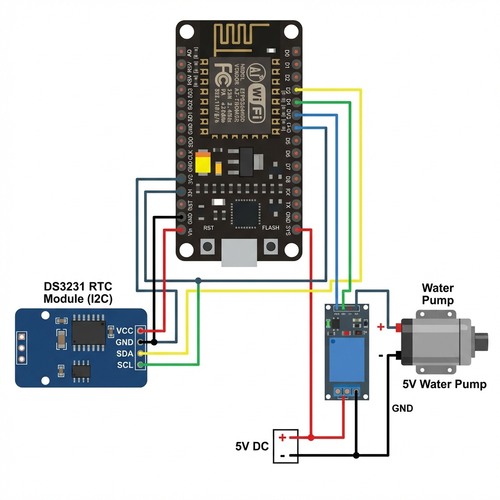

# Módulo de Riego

## Descripción General
El módulo de riego gestiona el regado automático de plantas a través de una programación basada en el tiempo. Integra un RTC (Reloj en Tiempo Real) para una sincronización precisa y proporciona una interfaz web para su gestión.

## Detalles de Implementación
- **Ubicación**: `server/firmware/apps/irrigation/`
- **Controlador Principal**: `controller.hpp` (Clase: `IrrigationSystem`)
- **Gestión del Reloj**: `utils/ds3231.hpp` (Clase: `DS3231Manager`)
- **Gestión de Temperatura**: `utils/TemperatureManager.hpp` (Clase: `TemperatureManager`)
- **Protocolo**: HTTP sobre puerto 80 (AsyncWebServer)

## Configuración de Hardware (ESP8266)
| Componente | Pin | Función |
| :--- | :--- | :--- |
| **Bomba de Agua 1** | D3 (GPIO 0) | Salida PWM (para riego) |
| **RTC (DS3231)**| D2/D1 | Comunicación I2C |

## Características Principales
1. **Sincronización RTC**: Utiliza el módulo DS3231 para mantener la fecha y hora incluso durante cortes de energía.
2. **Programación Dinámica**: Soporta hasta 20 tareas, definidas por día de la semana, hora y minuto.
3. **Temperatura Interna**: Monitorea la temperatura ambiente a través del sensor del RTC.

## Endpoints de la API
| Endpoint | Método | Descripción |
| :--- | :--- | :--- |
| `/waterPump1OnOFF` | GET | `?id=1&pwm=[0-255]` - Control manual de la bomba. |
| `/getClock` | GET | Cadena con la fecha/hora actual. |
| `/getList` | GET | Lista formateada de todas las tareas programadas. |
| `/addTaskEsp` | GET | `?days=[]&hour=&minutes=` - Añadir nueva programación. |
| `/getTemperature` | GET | Última lectura de temperatura en Celsius. |

