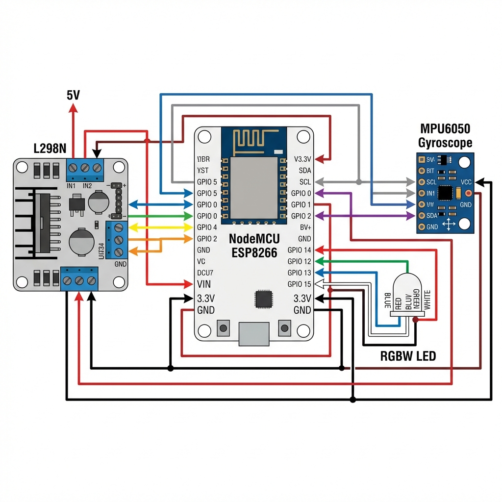

# Módulo del Coche Robot

## Descripción General
El módulo del coche robot proporciona la lógica para el control de motores, telemetría de giroscopio en tiempo real y comunicación de alta velocidad a través de WebSockets. Soporta tanto control manual vía HTTP como control remoto vía ESP-NOW.

## Detalles de Implementación
- **Ubicación**: `server/firmware/apps/robot car/`
- **Controlador Principal**: `controller.hpp` (Clase: `CarController`)
- **Telemetría**: `utils/gyroscope.hpp` (Clase: `GyroscopeManager`)
- **Sincronización en tiempo real**: `services/websocket.hpp` (Clase: `CarWebSocketHandler`)

## Configuración de Hardware (ESP8266)
| Componente | Pin | Función |
| :--- | :--- | :--- |
| **Velocidad Motor A** | D1 (GPIO 5) | PWM |
| **Dir Motor A** | D2 (GPIO 4) | Salida Digital |
| **Velocidad Motor B** | D3 (GPIO 0) | PWM |
| **Dir Motor B** | D4 (GPIO 2) | Salida Digital |
| **LED RGBW** | D5-D8 | Salidas Digitales (R, G, B, W) |
| **Giroscopio (MPU6050)**| D2/D1 | I2C (Compartido con el RTC) |

## Características

### 1. Control de Motores
Proporciona métodos para `moveForward()`, `moveBackward()`, `turnLeft()`, `turnRight()` y `stopMotors()`. La lógica está centralizada en el singleton `CarController`.

### 2. Telemetría en Vivo
- **Sensor**: MPU6050.
- **Datos**: Calcula los ángulos de **Inclinación (Pitch)** y **Balanceo (Roll)**.
- **Frecuencia**: Transmite datos 5 veces por segundo (5Hz).

### 3. Servidor WebSockets
Ubicado en `ws://[IP]/ws/car`. Transmite un objeto JSON que contiene:
- Dirección actual.
- Valores del giroscopio (X/Y).
- Estado del mando remoto (Activo/Inactivo).

## Endpoints de la API (HTTP)
| Endpoint | Método | Parámetros | Descripción |
| :--- | :--- | :--- | :--- |
| `/outputRobotUI` | GET | `?name=[Dir]` | Controla el movimiento (Arriba, Abajo, etc.). |
| `/changeColor` | GET | `?color=[Hex]` | Establece el color del LED del robot. |
| `/toggleLED` | GET | `?state=[0|1]` | Enciende/apaga el LED principal. |

## Integración con Mando Físico
El módulo utiliza el `RemoteControlHub` central para recibir comandos vía ESP-NOW.
- **Control Offline**: El control físico es totalmente autónomo y funciona mediante radio directa (ESP-NOW), sin necesidad de WiFi ni conexión web.
- **Telemetría Opcional**: Si hay conexión WiFi, el mando envía su telemetría directamente a React (`ws/remote`) y el robot la suya propia (`ws/car`), permitiendo visualización en tiempo real sin interferir en el control físico.
