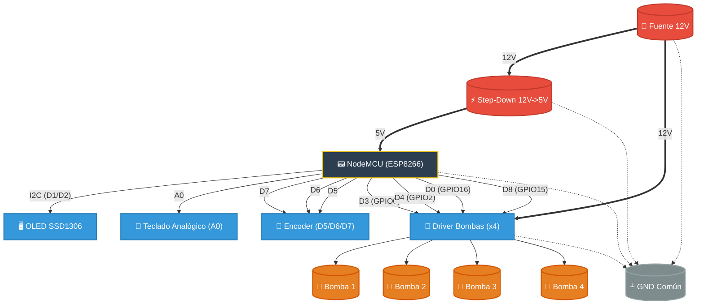

# 🍹 Módulo Máquina de Bebidas (NodeMCU ESP8266)

## 📋 Descripción General
El módulo **Máquina de Bebidas** gestiona la selección y el dispensado de bebidas y cócteles. Proporciona una interfaz de usuario física utilizando una **pantalla OLED** y un **encoder rotativo**, permitiendo el funcionamiento autónomo sin necesidad de un smartphone.

## 🛠 Detalles de Implementación
- **📍 Ubicación**: `server/firmware/apps/drinks machine/`
- **🧠 Controlador Principal**: `controller.hpp` (Clase: `EncoderManager`)
- **📺 IU/Pantalla**: `utils/display.hpp` (Clase: `DisplayManager`)
- **🖼 Activos (Assets)**: `utils/display.hpp` (Espacio de nombres: `DisplayAssets`)

## 🛠 Configuración del Entorno (Arduino IDE)
Para poder cargar el código en el NodeMCU, necesitas instalar las definiciones de la placa y algunas librerías específicas:

### 1. Placa (Board Manager)
1.  Abre Arduino IDE y ve a **File** -> **Preferences**.
2.  En "Additional Boards Manager URLs", añade: `http://arduino.esp8266.com/stable/package_esp8266com_index.json`
3.  Ve a **Tools** -> **Board** -> **Boards Manager**.
4.  Busca `esp8266` e instala la última versión por *ESP8266 Community*.
5.  Una vez instalado, selecciona la placa: **NodeMCU 1.0 (ESP-12E Module)**.

### 2. Librerías Necesarias (Library Manager)
Ve a **Sketch** -> **Include Library** -> **Manage Libraries...** e instala:
*   **ESP Async TCP** de *ESP32Async* (⚠️ IMPORTANTE: Instalar esta versión).
*   **ESPAsyncWebServer** de *ESP32Async*.
*   **ArduinoJson** (v6.x).
*   **Adafruit GFX Library**.
*   **Adafruit SSD1306**.
*   **BfButton**.
*   **RTClib** de *Adafruit* (Para el módulo de Riego).

## ⚡ Configuración de Hardware (ESP8266)

> **Placa en Arduino IDE**: Seleccionar `NodeMCU 1.0 (ESP-12E Module)`.

### 💧 Bombas (Pumps)
| Componente | GPIO | Pin NodeMCU | Notas |
| :--- | :--- | :--- | :--- |
| **Bomba 1** | GPIO 0 | D3 | Cocacola |
| **Bomba 2** | GPIO 2 | D4 | Naranja / Mixer |
| **Bomba 3** | GPIO 16| D0 | Vodka / Alcohol |
| **Bomba 4** | GPIO 15| D8 | Granadina / Sirope |

### 🖥 Pantalla OLED (I2C)
| Función | GPIO | Pin NodeMCU |
| :--- | :--- | :--- |
| **SDA** | GPIO 4 | D2 |
| **SCL** | GPIO 5 | D1 |

### 🔢 Sistema de Entrada Híbrido (Dual Input)
El sistema soporta el uso simultáneo de ambos métodos de entrada:

#### 1. Teclado Analógico (Recomendado)
| Función | GPIO | Descripción |
| :--- | :--- | :--- |
| **Señal Analog** | A0 | Lectura de botones por voltaje (Escalera de resistencias) |

#### 2. Encoder Rotativo (Legacy / Opcional)
| Función | GPIO | Pin NodeMCU |
| :--- | :--- | :--- |
| **CLK** | GPIO 13 | D7 |
| **DT** | GPIO 12 | D6 |
| **SW** | GPIO 14 | D5 |

## 🔌 Sistema de Alimentación
El proyecto se alimenta mediante una fuente de **12V DC**, dividiendo la potencia de la siguiente manera:
1.  **🚀 Potencia (12V)**: Conectada directamente a la entrada de alimentación de los drivers de las bombas (MOSFETs/Relés) para mover los motores.
2.  **🧠 Lógica (5V)**: Se utiliza un **Step-Down (Buck Converter)** para reducir los 12V a 5V.
    -   Salida 5V -> Conectada al pin **Vin** del NodeMCU/ESP8266.
    -   Tierras (GND) unidas entre la fuente de 12V y la salida de 5V.

## ✨ Características

### 1. 📟 Interfaz Autónoma
El sistema utiliza la **pantalla OLED** para mostrar un menú de líquidos (Agua, CocaCola, Vodka, Naranja) y cócteles predefinidos (Sex on The Beach, etc.).

### 2. 🔄 Máquina de Estados de Navegación
El botón del encoder permite navegar a través de diferentes pantallas:
- **🏠 Index Server**: Menú principal de selección de bebidas.
- **❓ Pantalla de Confirmación**: Pregunta "Aceptar?" antes de servir.
- **⏳ Pantalla de Servicio**: Muestra el estado mientras las bombas están activas.
- **✅ Pantalla Final**: Confirmación de bebida servida.

### 4. ↩️ Navegación Inteligente (Context-Aware)
El sistema utiliza una lógica de navegación fluida para evitar errores de selección:
- **Botón IZQUIERDA (Joystick/Web/Teclado)**: 
    - En el **Menú de Selección**: Sube en la lista (funciona como `Anterior`).
    - En la **Pantalla de Confirmación**: Actúa como `Atrás`, volviendo al selector pero manteniendo la bebida actual.
- **Pulsación Larga (Encoder)**: Reinicia el sistema por completo (Reset al inicio).

### 5. 🔄 Sincronización Real-Time con React
Las listas de bebidas y el estado de selección están sincronizados al 100% con la web:
- **WebSocket (`/ws/drinks`)**: El ESP8266 emite cada cambio de posición. La web resalta automáticamente la tarjeta de la bebida seleccionada con efectos de neón.
- **Orden de Bebidas**: La lista de `controller.hpp` coincide exactamente con los `id` de la web para una experiencia unificada.

### 3. 🍹 Gestión Dinámica de Bebidas
Las bebidas se almacenan utilizando `std::vector` y se definen como `struct Drink` y `struct Cocktail`, lo que facilita añadir o modificar recetas sin reestructurar el código.

### 4. 🎨 Visuales Optimizados
Los iconos de cócteles y los activos de la IU se almacenan en `PROGMEM` como mapas de bits (bitmaps) para maximizar la RAM disponible para el servidor web y las tareas de red.

## 🔗 Endpoints de la API
Los endpoints para el módulo de bebidas se encuentran en `services/API.hpp` y permiten la activación remota del proceso de servicio.

## 🎮 Integración con Mando Físico
Este módulo soporta el control remoto a través del joystick físico:
- **⬆️/⬇️ Joystick Arriba/Abajo**: Navegación por el menú de bebidas (simula el encoder).
- **🔘 Botón del Joystick**: Selecciona la bebida o cóctel actual (simula el clic del encoder).
- **📡 Control Offline**: El control físico es totalmente autónomo y funciona vía ESP-NOW, sin necesidad de WiFi ni conexión web.
- **📊 Telemetría Opcional**: Los movimientos del mando se reflejan en tiempo real en React mediante una conexión directa entre el mando físico y la web (WebSocket `ws/remote`).
